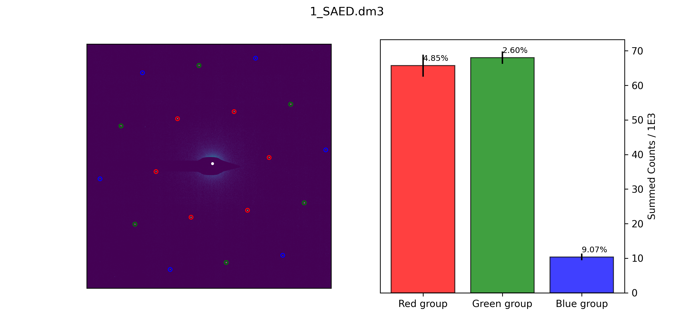

# Graphene Layer Analyser

## Overview

This project aims to analyse electron-microscope diffraction patterns of graphene, with the aim of being able to differentiate between monolayer and bilayer/few-layer samples. Current diffraction pattern analysis tools require significant human interaction, and are therefore time-consuming, particularly for large datasets. The necessity for human interaction also reduces reproducibility. By developing an algorithmic-based analysis tool, it is hoped that the field of graphene metrology will be improved, because layer-analysis of samples will become more approachable.

This aims to be a convenient tool to implement a new metrology technique for measuring the layered-ness of graphene. The standard is implemented by performing aperture photometry on the diffraction spots, summing the spots and commparing first and second diffraction-spot 'rings'. The code implementing this is found in `windows.py`. The remainder of the code, including automatic segmentation/grouping, plotting/graphing, automatic spot-finding etc. is for convenience.

## Using the program

To use the program, after installing necessary libraries and setting up your environment, type

`python main.py -f filename -s`

where filename is the name of the filename to be processed. The program can also analyse batches of filenames, specified as a list in the command line or, more conveniently, using wildcards in the terminal. The program requires an empty folder/directory to save files into. The flag `-s` commands the program to display the figure rather than save, and ought only be used when processing single files. By default, the program searches for `output` however this can be specified with `--output`. Currently parallelisation is not yet implemented. Help text can be accessed by typing `python main.py --help`.

## Manifest

Here an overview of the locations of important datastructures can be found. This list is organised in the order that a new user might want to look through the source code, should they want to familiarise themselves with this program's workings.
* `main.py` - To become the controller/dispatcher/main executable
* `pattern_processor.py` - Contains `process()` which actually analyses a diffraction pattern, as well as various datastructures for results and tunings.
* `diffraction_spots.py` - The `SpotGroup` class definition and spot segmentation functions
* `windows.py` - Contains classes and methods implementing the aperture photometry aspect of spot intensity integration
* `user_interface.py` - The user interface
* `methods.py` - Contains miscellaneous methods.

## Techniques

### Peak finding

Currently, a file is initially searched for peaks using SciPy's `peak_local_max()` method. These initial peaks are fitted to gaussians to determine a median of the full-width-half-maxima of these initial diffraction spots. With this information `peak_local_max()` is re-run using the FWHM to inform the minimum-distance filter in the peak-finder. There is a gaussian filtration/dilation of the image in-between the two peak-searches.

### Peak Segmentation

Next the peaks are segmented. Initially they are segmented according to a radial distance from an estimated central position. The central position is always behind a physical beam-stop, so its location must be inferred. This has been very susceptible to a bad estimation of the central/zeroth-order spot position in the image, and getting it to work in every circumstance has been tricky. Currently an initial estimation is made by calculating the centre-of-mass of the (clipped) image. The `group_radially()` method is then run. These groups are assumed to be approaching circular due to the nature of `group_radially()`. Circumcentres of the cyclic permutations of triplets of all the spots in each radial group are computed, and the whole set of circumcentres are then median-ed to produce a new estimate of the zeroth-order spot's position. Then the radial grouping is performed again.

After grouping radially, the spots are then segmented by polar coordinate about the best-estimate zeroth-order spot, to separate different twists if there is a twisted sample and also just to cut out noise in the form of falsely identified spots. The semgentation works by folding the polar coordinate by modulo 60° (since Graphene's diffraction pattern is six-fold symmetric). This reduced/folded space is then split into angular segments (taking care of boundary conditions...) and the spots are differentiated/segmented by which segment they fall into.

Many of the processes involved in peak segmentation and grouping are stored in the `diffraction_spots.py` module. A class for groups of spots, `SpotGroup` and methods for segmentation are stored here.

### Peak Intensity Measurement

The intensities of each peak are measured and used to differentiate between few-layer and monolayer samples. The intensity of each peak is measured separately, however caching is used in some places and this should be made as fast as possible. Optimisation can wait for the minute though.

Intensity measurement is made using windows. For a circular window, a circular selected-area mask is formed around the targeted peak, along with an annular mask co-centred, for peak-localised background subtraction. The intensity is the summed intensity of the pixels in the window after the average background has been subtracted. This implementation is designed with extensibility in mind, should other window shapes be needed (such as a square window, for computational efficiency).

For each image a `Window` object is defined. This defines a number of things that will remain constant for all intensity calculations for spots in a particular image/diffraction-pattern. Intensity measurements are made on 'sub-windows' of the image for computational efficiency. These are just cropped areas of the original image centred on the peak of interest, generated lazily, when each peak is processed. The sub-window size is defined in the `Window` as well as the shape of each integration window around each peak.

This portion of the code works fairly well, so I don't plan on altering it or optimising it at least until the segmentation problems are ironed out.

### Error Propagation

The errors for each spot are determined by firstly estimating the pixel-error from the background pixels. The mean of the background annulus is taken, then the RMS deviation from the background-mean of all the background pixels is used. This is then squared, multiplied by the number of pixels used in the selected-area, and then square-rooted (a sum-in-quadrature). This result is taken to be the uncertainty in the intensity of that spot (see `windows.CircularWindow.get_intensity()`. The uncertainty of a SpotGroup is then taken to be the sum-in-quadrature of the uncertainties of all the spots within that SpotGroup (see `diffraction_spots.SpotGroup.calculate_integrated_intensity()`). 

Using this error-propogation approach, of the diffraction-patterns tested, the uncertainties appear to mostly be between 0.1% and 5%.

## Examples

### Successes

## Next Steps

* Polish GUI
* Test under various noise environments